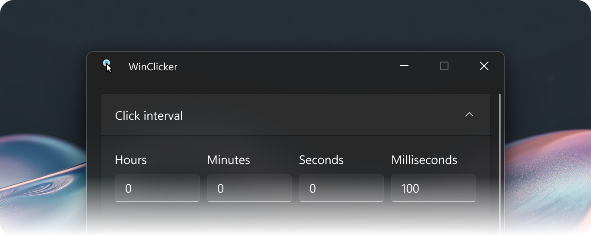

<picture align="center">
    
</picture>

<h1 align="center">WinClicker</h1>

    <strong>WinClicker</strong> is a high‐performance, lightweight autoclicker designed for Windows 10/11.

    
🌐 Choose language

    <ul>
        <li><a href="./Translations/README.de.md">🇩🇪 Deutsch</a></li>
    </ul>

## 📦 Installation

Go to the [WinClicker Releases page](https://github.com/randomguy-2650/WinClicker/releases), scroll down to the **Assets** section and download the `.zip` file that matches your system architecture (x64 or ARM64).

Extract the contents to a folder of your choice and run the `WinClicker.exe` file inside. If you get a SmartScreen warning, click **More info** and then click **Run anyway**.

This may not work if you use [Smart App Control](https://learn.microsoft.com/en-us/windows/apps/develop/smart-app-control/overview) or [AppLocker](https://learn.microsoft.com/en-us/windows/security/application-security/application-control/app-control-for-business/applocker/applocker-overview), have set enterprise settings or if your antivirus flagged the program (in this case, add the extracted folder to the antivirus’s blocklist).

_Please keep the included [`THIRD-PARTY-NOTICES.md`](./THIRD-PARTY-NOTICES.md) file in the folder with the application._

## 💻 Supported operating systems

- Windows 10, version 1809 (Build 17763) or later
- Windows 11, version 21H2 (Build 22000) or later

## 🖊️ Style guide

This project follows the [Placer Style Guide](https://github.com/placer-toolkit/placer-style-guide/?tab=readme-ov-file) for all project writing and formatting standards.

## 📄 Licence

This project is licensed under the [MIT License](./LICENSE.md).

Dependencies are subject to their respective licences and may or may not use the MIT License used for this project.

---

© 2026 randomguy-2650 and his contributors

_Building from source requires the Windows App SDK and required Visual Studio workloads._
