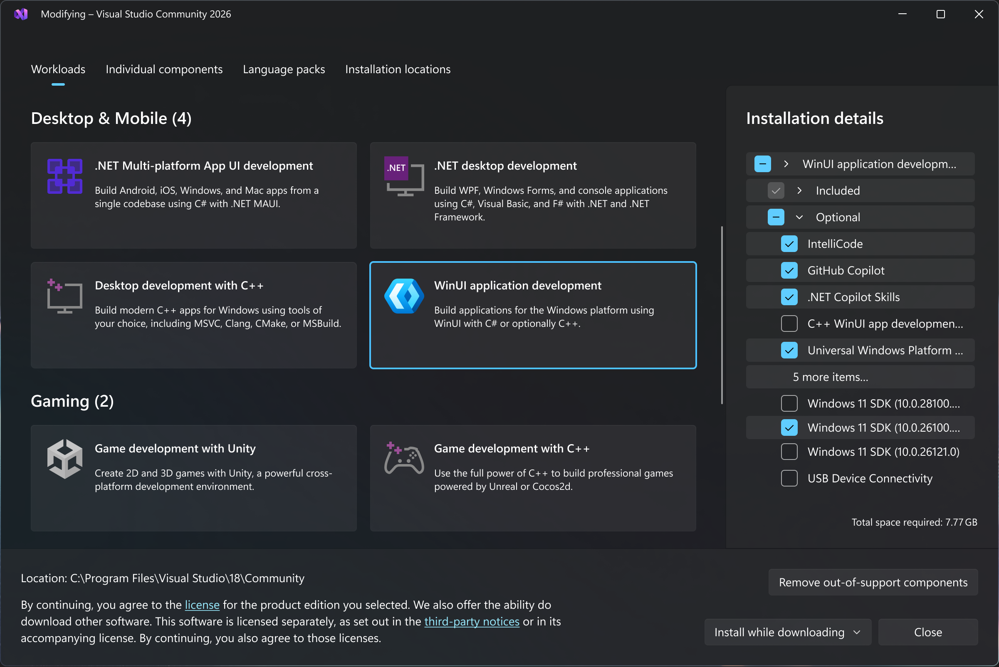

<picture align="center">
    
</picture>

<h1 align="center">WinClicker</h1>

<p align="center">
    <strong>WinClicker</strong> ist ein leistungsstarker, leichter Autoclicker,
    der für Windows 10/11 entwickelt wurde.
</p>

<details>
    <summary>🌐 Sprache auswählen</summary>
    <ul>
        <li><a href="../README.md">🇬🇧 English</a></li>
    </ul>
</details>

## 📦 Installation

Gehe zur [WinClicker Releases‐Seite](https://github.com/randomguy-2650/WinClicker/releases), scrolle nach unten zum Abschnitt **Assets** und lade die `.zip`‐Datei herunter, die zu deiner Systemarchitektur passt (x64 oder ARM64).

Entpacke den Inhalt in einen Ordner deiner Wahl und starte die darin enthaltene `WinClicker.exe`. Wenn du eine SmartScreen‐Warnung erhältst, klicke auf **Weitere Informationen** und dann auf **Trotzdem ausführen**.

Dies funktioniert möglicherweise nicht, wenn du [Smart App Control](https://learn.microsoft.com/de-de/windows/apps/develop/smart-app-control/overview) oder [AppLocker](https://learn.microsoft.com/de-de/windows/security/application-security/application-control/app-control-for-business/applocker/applocker-overview) verwendest, strenge Unternehmenseinstellungen vorgenommen hast oder dein Antivirenprogramm das Programm blockiert (füge in diesem Fall den entpackten Ordner zur Blocklist deines Antivirenprogramms hinzu).

_Bewahre bitte die mitgelieferten [`LICENSE.md`](../LICENSE.md)‐ und [`THIRD-PARTY-NOTICES.md`](../THIRD-PARTY-NOTICES.md)‐Dateien im selben Ordner wie die Anwendung auf._

## 💻 Unterstützte Betriebssysteme

- Windows 10, Version 1809 (Build 17763) oder neuer
- Windows 11, Version 21H2 (Build 22000) oder neuer

## 🛠️ Aus dem Quellcode bauen

**Voraussetzungen:**

- Auf deinem Computer muss Windows 10 Build 17763, Windows 11 Build 22000 oder neuer installiert sein.
- Auf deinem Computer muss Visual Studio 2022 oder neuer installiert sein (siehe Schritt 2, wenn du das noch nicht installiert hast).

Aktiviere den [Entwicklermodus](https://learn.microsoft.com/de-de/windows/advanced-settings/developer-mode) auf deinem Computer.

Lade [Visual Studio 2026](https://visualstudio.microsoft.com/downloads) herunter und installiere es (die Community‐Edition reicht aus).

Installiere die **WinUI application development**‐Workload und kreuze das neueste Windows 11 SDK an.



Installiere die [XAML Styler](https://marketplace.visualstudio.com/items?itemName=TeamXavalon.XAMLStyler)‐Erweiterung aus dem Visual Studio Marketplace.

Klone das WinClicker‐Repository mit Git:

```bash
git clone https://github.com/randomguy-2650/WinClicker.git
```

Öffne `WinClicker.slnx` in Visual Studio, um WinClicker zu bauen und auszuführen.

## 🖊️ Styleguide

Dieses Projekt folgt dem [Placer Style Guide](https://github.com/placer-toolkit/placer-style-guide/blob/2.x/translations/de/README.de.md) für sämtliche Schreib‐ und Formatierungsstandards des Projekts.

## 📄 Lizenz

Dieses Projekt ist unter der [MIT‐Lizenz](../LICENSE.md) lizenziert. Marketing‐Assets sind urheberrechtlich geschützt und fallen nicht unter die MIT‐Lizenz.

Abhängigkeiten unterliegen ihren jeweiligen Lizenzen und verwenden möglicherweise nicht die für dieses Projekt verwendete MIT‐Lizenz.

---

© 2026 randomguy-2650 und Mitwirkende
