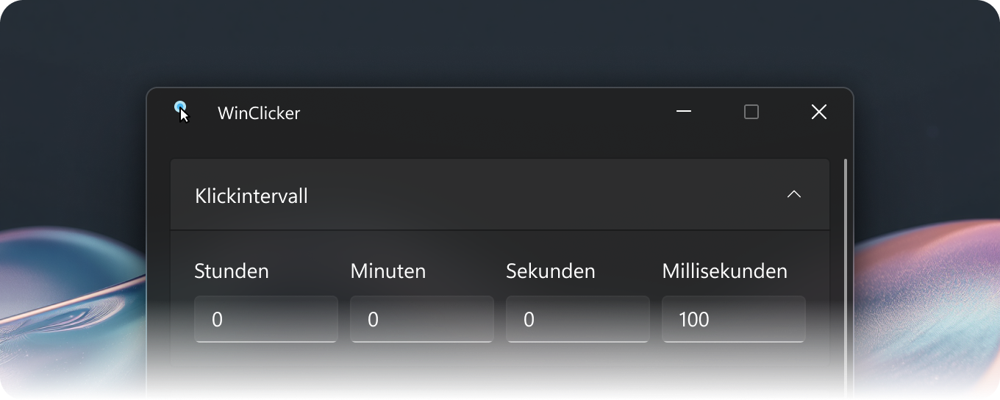

<h1 align="center">
    <picture>
        
    </picture>
</h1>

    <strong>WinClicker</strong> ist ein leistungsstarker, leichter Autoclicker,
    der für Windows 10/11 entwickelt wurde. Von Grund auf mit <strong>WinUI 3</strong> erstellt,
    bietet er ein modernes, flüssiges Erlebnis, das sich auf deinem Desktop wie zu Hause anfühlt.

    
🌐 Sprachen

    <ul>
        <li><a href="../README.md">🇬🇧 English</a></li>
    </ul>

## 📦 Installation

Gehe zur [WinClicker Releases‐Seite](https://github.com/randomguy-2650/WinClicker/releases), scrolle nach unten zum Abschnitt **Assets** und lade die `.zip`‐Datei herunter, die zu deiner Systemarchitektur passt (x64 oder ARM64).

Entpacke den Inhalt in einen Ordner deiner Wahl und starte die darin enthaltene `WinClicker.exe`. Wenn du eine SmartScreen‐Warnung erhältst, klicke auf **Weitere Informationen** und dann auf **Trotzdem ausführen**.

Dies funktioniert möglicherweise nicht, wenn du [Smart App Control](https://learn.microsoft.com/de-de/windows/apps/develop/smart-app-control/overview) oder [AppLocker](https://learn.microsoft.com/de-de/windows/security/application-security/application-control/app-control-for-business/applocker/applocker-overview) verwendest, strenge Unternehmenseinstellungen vorgenommen hast oder dein Antivirenprogramm das Programm blockiert (füge in diesem Fall den entpackten Ordner zur Blocklist deines Antivirenprogramms hinzu).

_Bewahre bitte die mitgelieferte [`THIRD-PARTY-NOTICES.md`](../THIRD-PARTY-NOTICES.md)‐Datei im selben Ordner wie die Anwendung auf._

## 💻 Unterstützte Betriebssysteme

- Windows 10, Version 1809 (Build 17763) oder neuer
- Windows 11, Version 21H2 (Build 22000) oder neuer

## 🖊️ Styleguide

Dieses Projekt folgt dem [Placer Style Guide](https://github.com/placer-toolkit/placer-style-guide/blob/2.x/translations/de/README.de.md) für sämtliche Schreib‐ und Formatierungsstandards des Projekts.

## 📄 Lizenz

Dieses Projekt ist unter der [MIT‐Lizenz](../LICENSE.md) lizenziert.

Abhängigkeiten unterliegen ihren jeweiligen Lizenzen und verwenden möglicherweise nicht die für dieses Projekt verwendete MIT‐Lizenz.

---

© 2026 randomguy-2650 und Mitwirkende

_Das Kompilieren aus dem Quellcode erfordert das Windows App SDK und die erforderlichen Visual Studio‐Workloads._
